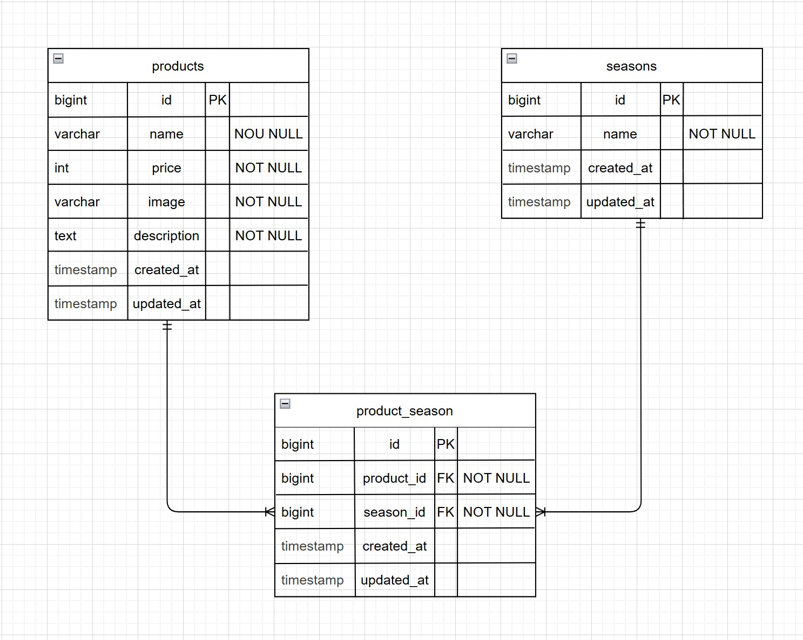

# coachtech-Freshly-picked

## ◎ フレームワーク / ライブラリ
Laravel 8.x

本アプリケーションは、
商品情報の登録・更新・検索・季節分類を行うミニECシステムです。
画像アップロードやバリデーション、季節の複数選択など、Laravelの基本機能を搭載しています。

---

## ◎ プロジェクト概要

- 商品一覧・詳細・登録・更新・削除機能
- 商品の季節分類（多対多リレーション）
- 商品画像のアップロード（storageリンク対応）
- キーワード検索・価格並び替え
- バリデーション（登録・更新時）
- Docker環境での開発・実行

---

## ◎ セットアップ手順

```
git clone git@github.com:nasu-masa/coachtech-Freshly-picked.git
cd coachtech-Freshly-picked
```

### Docker 起動
```
docker-compose up -d --build
```

### PHP コンテナに入る
```
docker-compose exec php bash
```

### Laravel セットアップ
```
composer install
cp .env.example .env   # 環境変数を適宜変更
php artisan key:generate
```

### 画像保存のセットアップ
画像は `storage/app/public` に保存されます。
初回セットアップ時は以下を実行してください：

```
php artisan storage:link
```

### データベース構築
```
php artisan migrate
php artisan db:seed
# または
php artisan migrate --seed
```

---

## ◎ 開発環境

- 商品一覧画面 : http://localhost/products
- phpMyAdmin  : http://localhost:8080

---

## ◎ 使用技術（実行環境）

- Docker Compose 3.8
- Nginx 1.21.1
- PHP 8.1-fpm
- MySQL 8.0.26
- phpMyAdmin

---

## ◎ PHP 拡張

- pdo_mysql
- zip
- mbstring（UTF-8 / Japanese）

---

## ◎ PHP 設定

- timezone: Asia/Tokyo

---

## ◎ フレームワーク / ライブラリ

- Laravel 8.x
- Blade（テンプレートエンジン）

※ 本プロジェクトでは Vite / npm は使用していません。

---

# ◎ ER 図


---

## ◎ 機能一覧（Freshly-picked）

- 商品一覧表示
- 商品検索（キーワード）
- 価格並び替え（高い順 / 低い順）
- ページネーション
- 商品詳細表示
- 商品更新フォーム
- 商品削除
- 商品登録フォーム
- 商品画像アップロード
- 季節の複数選択（多対多）

---

## ◎ ルーティング概要

```
/products                     商品一覧（GET）
/products/search              商品検索（GET）
/products/detail/{id}         商品詳細（GET）
/products/register            商品登録フォーム（GET）
/products/register            商品登録処理（POST）
/products/{id}/update         商品更新フォーム（GET）
/products/{id}/update         商品更新処理（POST または PUT）
/products/{id}/delete         商品削除（POST または DELETE）
```

---

## ◎ Blade（View）構成

- layouts/app.blade.php（共通レイアウト）
- product/index.blade.php（商品一覧・検索）
- product/show.blade.php（商品詳細・更新）
- product/create.blade.php（商品登録）

---

## ◎ CSS 構成

```
public/css/
├── app.css          … 共通レイアウト・ヘッダーなど
├── product.css      … 商品一覧・詳細・登録・更新の画面スタイル
├── sanitize.css     … リセットCSS
└── utility.css      … 汎用ユーティリティ（幅・余白など）
```

---

## ◎ Controller 構成

- ProductController.php
（商品一覧・検索・詳細・更新・削除・登録を担当）

---

## ◎ Request（バリデーション）

- UpdateProductRequest.php
- StoreProductRequest.php

---

## ◎ Database（Seeder / Migration）

### ◎ Seeder

```
├── ProductSeeder.php
├── SeasonSeeder.php
└── ProductSeasonSeeder.php
```

### ◎ Migration

- create_products_table
- create_seasons_table
- create_product_season_table

---

## ◎ ライセンス

本アプリケーションは学習目的で作成したものです。
